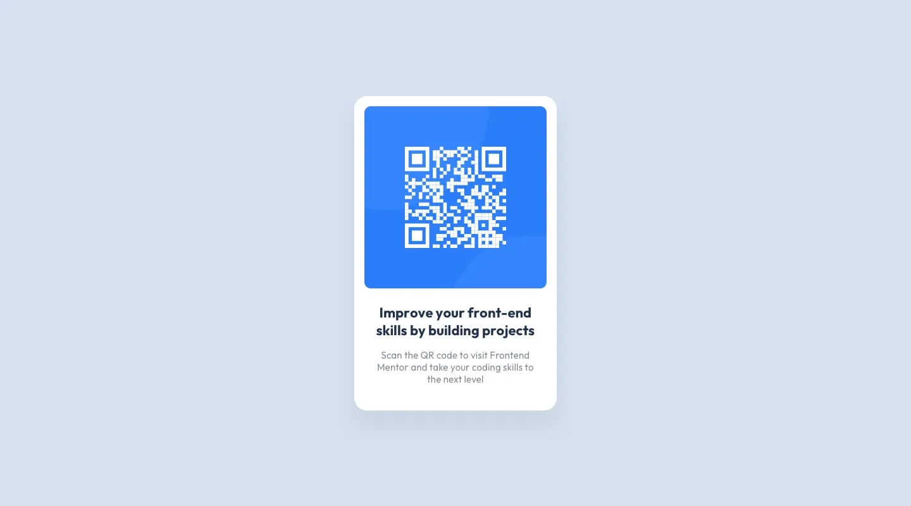
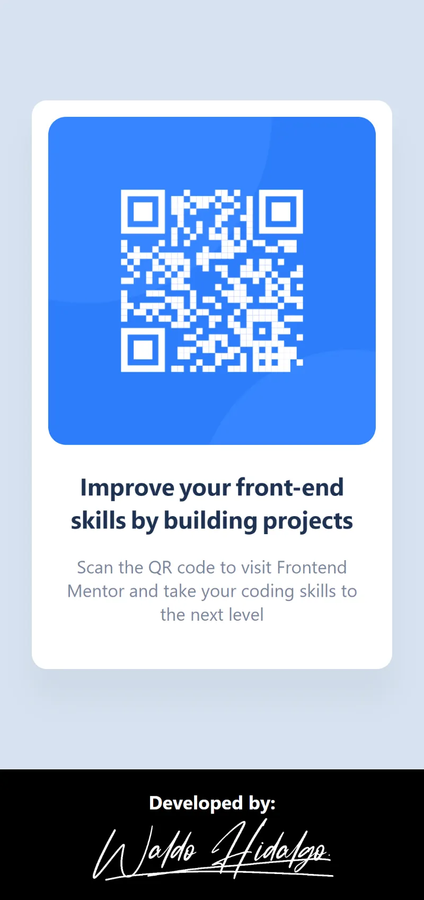
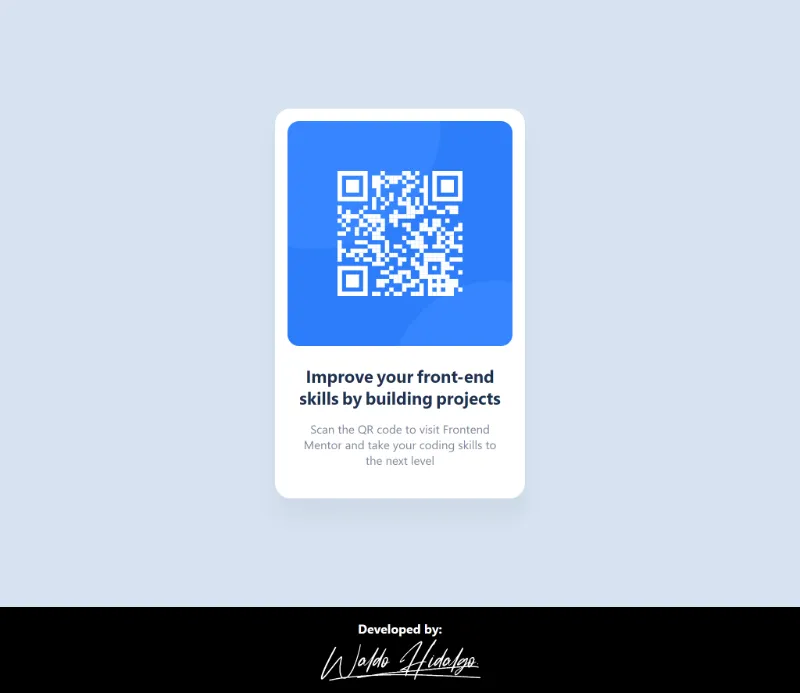

# QR code component

Repositorio con el código solución al proyecto: [QR code component challenge on Frontend Mentor](https://www.frontendmentor.io/challenges/qr-code-component-iux_sIO_H)

## Tabla de Contenidos

- [QR code component](#qr-code-component)
  - [Tabla de Contenidos](#tabla-de-contenidos)
  - [The challenge](#the-challenge)
  - [Diseños a Replicar](#diseños-a-replicar)
    - [1.Mobile Design](#1mobile-design)
    - [2.Desktop Design](#2desktop-design)
  - [Proyecto Realizado](#proyecto-realizado)
    - [1.Mobile Screen](#1mobile-screen)
    - [2.Desktop Screen](#2desktop-screen)

## The challenge

El proyecto consiste en realizar lo siguiente:

> Your challenge is to build out this QR code component and get it looking as close to the design as > possible.
>
> You can use any tools you like to help you complete the challenge. So if you've got something you'd > like to practice, feel free to give it a go.

## Diseños a Replicar

### 1.Mobile Design

### 2.Desktop Design

## Proyecto Realizado

### 1.Mobile Screen

### 2.Desktop Screen

